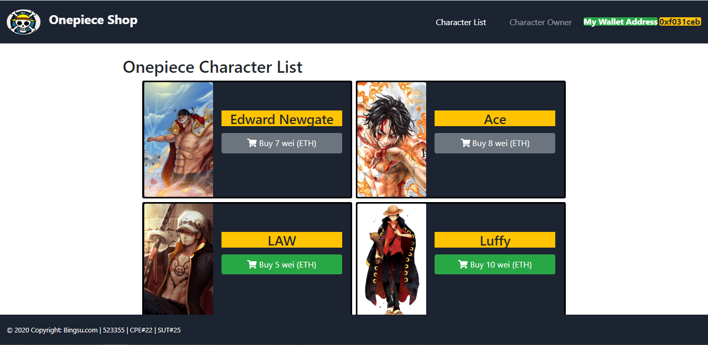
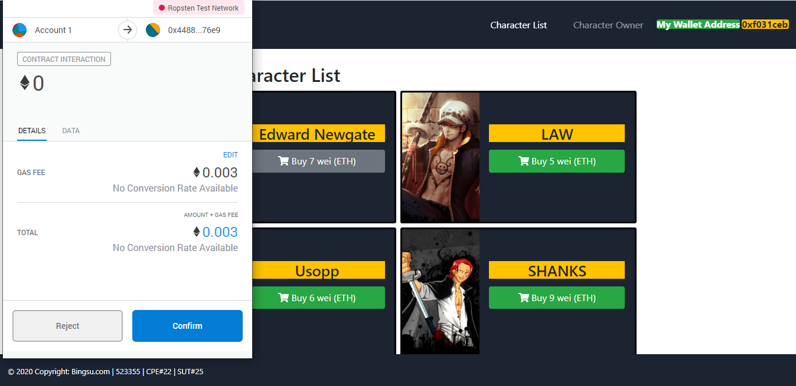
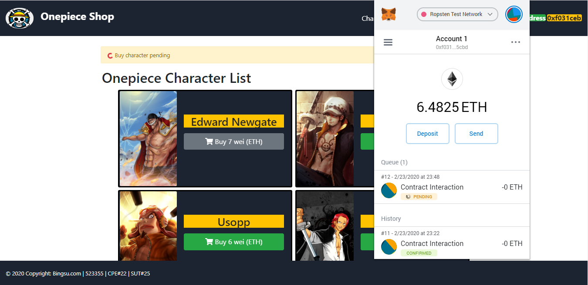
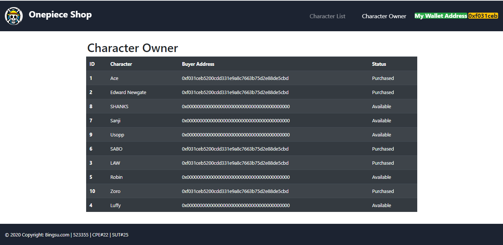

# Smart-contract-Onepiece-shop
 ตัวอย่าง เปิดเว็บเเอปพลิเคชั่นซื้อขายโดยใช้ Ethereum Test network.

 ### วิธีการติดตั้ง
 1. `git clone https://github.com/newler55/Smart-contract-Onepiece-shop.git`
 2. `cd Smart-contract-Onepiece-shop`
 3. `npm install`
 4. `npm start`
 5. เปิดเว็บบราวเซอร์ http://localhost/

</img>

 ### วิธีการใช้งาน
 1. เลือก Character เเละกดปุม confirm เพื่อยืนยันการจ่าย ETH 
 </img>
 2. รอ PANDING ... จนเสร็จ
 </img>
 3. เลือก เมนู Character Owner เเละตรวจสอบ Character Owner ที่ Status จะเปลี่ยนเป็น Purchased
</img>
